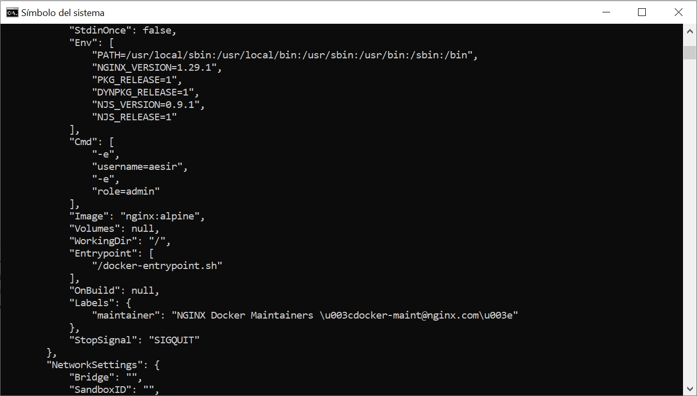
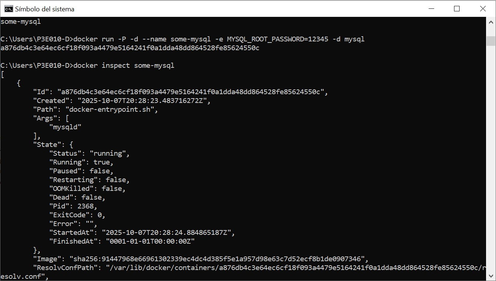

# Variables de Entorno
### ¿Qué son las variables de entorno?
Son pares nombre-valor dinámicos que almacenan información de configuración para programas y sistemas operativos, como la ubicación de carpetas o datos de autenticación. Se definen fuera del código de una aplicación y pueden actualizarse sin necesidad de modificar el programa. Son esenciales para desacoplar la configuración de la aplicación, asegurar la coherencia y permitir la automatización

### Para crear un contenedor con variables de entorno

```
docker run -d --name <nombre contenedor> -e <nombre variable1>=<valor1> -e <nombre variable2>=<valor2>
```

### Crear un contenedor a partir de la imagen de nginx:alpine con las siguientes variables de entorno: username y role. Para la variable de entorno rol asignar el valor admin.

```
docker run -d --name srv-web nginx:alpine -e username=aesir -e role=admin
```



### Crear un contenedor con la imagen de mysql, mapear todos los puertos
```
docker run -P -d --name some-mysql mysql
```

### ¿El contenedor se está ejecutando?
No

### Identificar el problema
Se deben especificar una variable de entorno para tener al contenedor en ejeecución.

### Para crear un contenedor con variables de entorno especificadas
- Portabilidad: Las aplicaciones se vuelven más portátiles y pueden ser desplegadas en diferentes entornos (desarrollo, pruebas, producción) simplemente cambiando el archivo de variables de entorno.
- Centralización: Todas las configuraciones importantes se centralizan en un solo lugar, lo que facilita la gestión y auditoría de las configuraciones.
- Consistencia: Asegura que todos los miembros del equipo de desarrollo o los entornos de despliegue utilicen las mismas configuraciones.
- Evitar Exposición en el Código: Mantener variables sensibles como contraseñas, claves API, y tokens fuera del código fuente reduce el riesgo de exposición accidental a través del control de versiones.
- Control de Acceso: Los archivos de variables de entorno pueden ser gestionados con permisos específicos, limitando quién puede ver o modificar la configuración sensible.

### Crear un contenedor con mysql, mapear todos los puertos y configurar las variables de entorno mediante un archivo
```
docker run -P -d --name some-mysql -e MYSQL_ROOT_PASSWORD=12345 -d mysql
```



### ¿Qué bases de datos existen en el contenedor creado?
Existen 4 bases de datos: 
| information_schema |
| mysql              |
| performance_schema |
| sys                |
