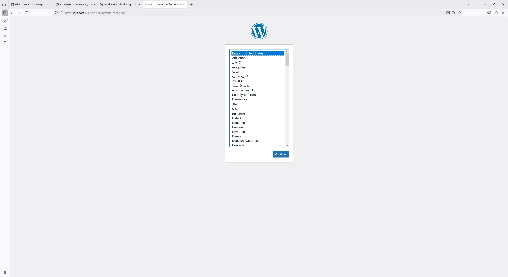

## Esquema para el ejercicio


### Crear la red
```
docker network create net-wp
```

### Crear el contenedor mysql a partir de la imagen mysql:8, configurar las variables de entorno necesarias
```
docker run -d \
  --name mysql \
  --network net-wp \
  -e MYSQL_ROOT_PASSWORD=rootpass \
  -e MYSQL_DATABASE=wordpress \
  -e MYSQL_USER=wpuser \
  -e MYSQL_PASSWORD=wppass \
  mysql:8.0
```
### Crear el contenedor wordpress a partir de la imagen: wordpress, configurar las variables de entorno necesarias
```
docker run -d \
  --name wordpress \
  --network net-wp \
  -e WORDPRESS_DB_HOST=mysql:3306 \
  -e WORDPRESS_DB_USER=wpuser \
  -e WORDPRESS_DB_PASSWORD=wppass \
  -e WORDPRESS_DB_NAME=wordpress \
  -p 8080:80 \
  wordpress:latest
```

De acuerdo con el trabajo realizado, en el esquema del ejercicio el puerto a es 8080

Ingresar desde el navegador al wordpress y finalizar la configuración de instalación.


Desde el panel de admin: cambiar el tema y crear una nueva publicación.
Ingresar a: http://localhost:9300/ 
recordar que a es el puerto que usó para el mapeo con wordpress
# COLOCAR UNA CAPTURA DEL SITO EN DONDE SEA VISIBLE LA PUBLICACIÓN.

### Eliminar el contenedor wordpress
# COMPLETAR

### Crear nuevamente el contenedor wordpress
Ingresar a: http://localhost:9300/ 
recordar que a es el puerto que usó para el mapeo con wordpress

### ¿Qué ha sucedido, qué puede observar?
# COMPLETAR

